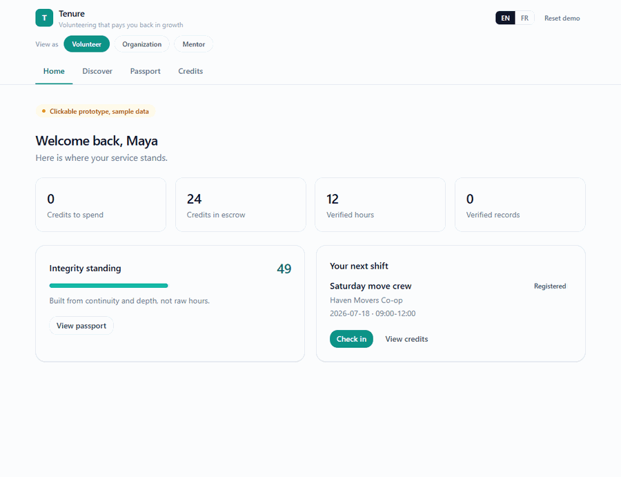

# Tenure

A volunteer platform prototype built around one idea: verified, sustained service should earn something real. Volunteers earn non-cash **learning credits** from verified shifts and spend them on mentorship, skill workshops, and career access. Organizations get a contained environment to manage the volunteers they bring in. Mentors offer the sessions those credits redeem.

> Working name. Bilingual (English and French), Canada-first. This repository is **R0**, a clickable front-end-only prototype with sample data. It proves the full reward loop before any backend exists.
>
> All the sample data in this repo is made up. Every organization, volunteer, mentor, and shift is fictional. There is no real charity, real person, or real service anywhere.



The clip walks the loop end to end: a volunteer checks in and out of a shift, the organization signs it off, that fourth verified shift crosses the continuity threshold to issue a Verified Service Record and vest the credits, and the volunteer spends them on a record-gated one-to-one mentorship.

## What this prototype demonstrates

If you're learning to build products like this, R0 is meant to be read as much as run:

- **Mechanism design in plain TypeScript.** Minting, escrow, vesting, a continuity threshold, per-organization monthly budgets, and a weighted integrity score all live in one readable file with no framework magic.
- **The API seam pattern.** Screens only ever talk to a `PlatformAPI` interface. R0 ships `MockAPI`, backed by fixtures and `localStorage`. A production build swaps in a real backend behind the same interface without touching a single screen.
- **Bilingual UI done properly.** Two i18next catalogs at strict key parity, pluralization rules in both languages, and bilingual content fields in the data model itself.
- **Fixtures that never go stale.** Sample dates are computed relative to today (the featured shift is always the coming Saturday), so the demo works identically whenever you clone it.
- **A three-role demo shell.** Volunteer, Organization, and Mentor views behind one switcher, with the URL as the source of truth for the active role.

## The reward model in one minute

The platform rewards depth and consistency, not raw hours.

- **Attendance Log (free, instant):** after any single shift you get an honest record of verified hours, stamped "single session, not assessed". It carries no platform endorsement.
- **Verified Service Record (earned):** the credential that carries weight. It is issued only after a continuity-and-depth threshold: repeat shifts across several weeks at the same organization, with independent corroboration. The same threshold vests your learning credits.
- **Learning credits:** mint on verified service (on-site check-in plus supervisor sign-off), sit in escrow, and become spendable when you earn a Verified Service Record. They are non-transferable, non-cashable, and redeem only for learning.
- **Integrity score:** weighted toward continuity and independent corroboration, so standing builds over weeks of service, not in one afternoon.

## Try the full loop

1. As **Volunteer**, open your next shift, check in (simulate arriving on-site), then check out to request sign-off.
2. Switch to **Organization**, open **Sign-off**, and approve the shift. This mints credits.
3. Approving the shift that crosses the threshold issues a **Verified Service Record** and vests the credits.
4. Back as **Volunteer**, see the record on **Passport** and spend credits in **Credits**. The premium one-to-one mentorships unlock once you hold a Verified Service Record.
5. Switch to **Mentor** to confirm the incoming session request.

**Reset demo** in the top bar restores the sample data at any time.

## Code tour

| Read this | To learn |
|---|---|
| [src/api/PlatformAPI.ts](src/api/PlatformAPI.ts) | The seam: interface, view models, and the two threshold constants that gate everything |
| [src/api/MockAPI.ts](src/api/MockAPI.ts) | The whole mechanism. `approveCheckIn` is the heart: mint, distinct-week counting, threshold check, vesting |
| [src/api/mockData.ts](src/api/mockData.ts) | Relative-date fixtures anchored to the coming Saturday |
| [src/state/platform.tsx](src/state/platform.tsx) | A small provider: async-query hook, revision-based refresh, toasts |
| [src/i18n/](src/i18n/) | English and French catalogs at strict key parity |
| [src/components/ui.tsx](src/components/ui.tsx) | The entire primitive set: Card, Button, LinkButton, badges, progress, empty and loading states |
| [scripts/capture_demo.py](scripts/capture_demo.py) | The Playwright walkthrough that produced the demo GIF above |

## Design notes

- **Front-end first.** R0 exists to prove the reward loop is legible and satisfying before paying for a backend. Every mechanic runs for real, just against `localStorage`.
- **HashRouter** so the prototype deploys to any static host with zero route configuration.
- **Versioned storage key** (`tenure.state.v1`, `v2`, ...) so a schema change reseeds cleanly instead of crashing on stale state.
- **Credits redeem only for learning** and never convert to cash, by design.

## Run it

```bash
cd tenure
npm install
npm run dev
```

Open the printed local URL. Use the **View as** switcher to move between the three views and **EN / FR** to switch language.

```bash
npm run build     # type-check and build to dist/
npm run preview   # serve the production build
```

## Known rough edges

Two small, safe starter tasks if you feel like contributing:

1. **CSV export does not quote fields.** [src/routes/org/Reports.tsx](src/routes/org/Reports.tsx) joins cells with commas and newlines directly. Today's sample data contains neither, so nothing breaks, but a volunteer name or translated header with a comma would shift columns. Proper CSV escaping (quote fields, double inner quotes) would make it robust.
2. **Four unused catalog keys.** `role.hint`, `org.noteLabel`, `common.registered`, and `nav.bookings` exist in both [src/i18n/en.json](src/i18n/en.json) and [src/i18n/fr.json](src/i18n/fr.json) but nothing renders them. Either wire them up where they were clearly intended (the sign-off note label, for example) or remove them from both catalogs.

## License

MIT. Copyright Kevin Yu (github.com/exekyute).
